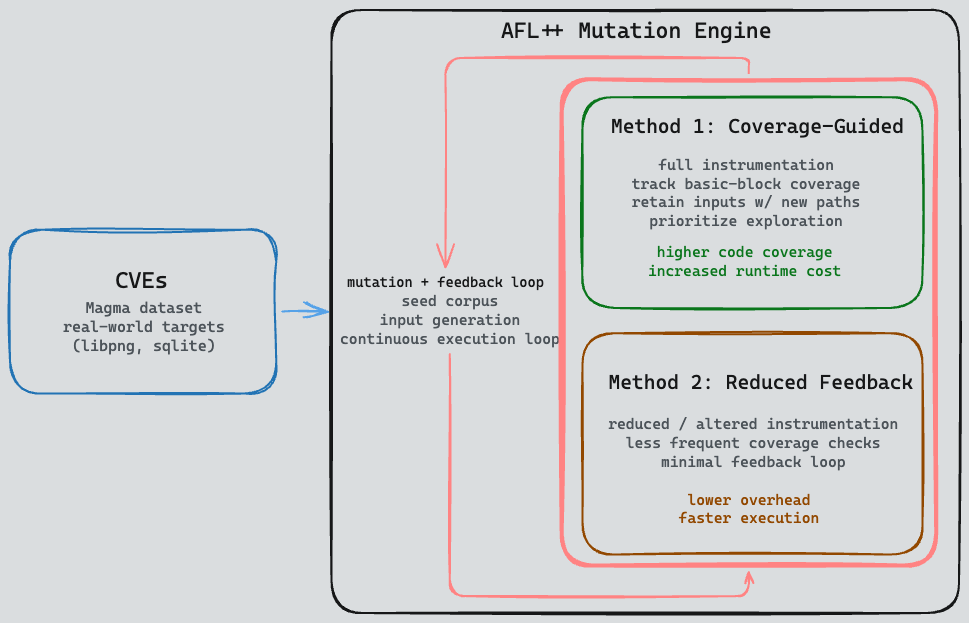

### Overview

This repository contains AFL++ and Magma in the AFLplusplus and magma directories (respectively). When the aflplusplus fuzzer is specified in Magma’s configrc, Magma will pull from the AFL++ in AFLplusplus. This functionality is available on main branch, while other branches contain various features and modifications. 

This repository contains implementations of selective coverage feedback suppression strategies built on AFL++, exploring whether full coverage guidance is necessary throughout an entire fuzzing campaign. We implement and evaluate two approaches: a stochastic method (LCF-S) that probabilistically suppresses coverage feedback on individual executions, and a temporal method (LCF-T) that disables feedback after a predefined point in time. 

#####  The code includes:

- LLVM-IR compile-time hook modifications for
    - Basic block instrumentation method
    - Branch count instrumentation method
    - Function instrumentation method

- AFL++ modifications for hybrid instrumentation strategies
    - LCF-S Implementation
    - LCF-T Implementation
    - Good Turing coverage mode 

- MAGMA evaluation setup

### System Overview

### Running

Running either LCF-T or LCF-S in the aforementioned branches will require additional configuration. To toggle LCF-S while running interactively, one must use the `-F` option in the command that begins AFL++, and include an argument in the range p ∈ [0,100] representing the percentage of seeds which receive coverage feedback. To configure this while running Magma, the variable `FUZZ_PCT` may be added to the configrc with value p.

The build process for the LCF-T fuzzer remains identical to AFL++. To instrument a target program, we utilize the standard AFL++ instrumentation methodologies. As for configuration, before fuzzing we must set the environmental variable `AFL_HYBRID_RATIO` to any value between $0$ and $1$. Then, the `afl-fuzz` command can be used normally with the standard syntax and options but with a mandatory `-V` flag to specify the number of seconds the campaign should run for. This is described in the AFL++ documentation. Upon launching the campaign, the standard AFL++ UI will appear, but with the addition that when the phase changes, a message will appear to indicate it.

Md-adaptive-coverage branch usage. Using -A [threshold] flag when launching afl-fuzz. 
Example: ` afl-fuzz -A 0.05 -i seeds -o output -- ./target @@ ` Set ` AFL_DEBUG_ADAPTIVE=1 ` to see real-time coverage decisions. Threshold is optional; defaults to 0.05 (5%).

### Branches

- Main 

    - Contains a modified Magma, which will pull AFL++ locally from AFLplusplus when the afplusplus fuzzer is specified

- Marco

    - Implements the stochastic feedback-suppression approach (LCF-S), where AFL++ probabilistically skips coverage analysis on a per-execution basis.

- hybrid-ratio-leo 

    - This branch implements LCF-T, a time-based hybrid fuzzing strategy for AFL++ that transitions from coverage-guided fuzzing to a black-box mode after a user-defined time fraction of the campaign duration. It introduces a global phase switch driven by the `HYBRID_RATIO` flags.

- Basic-clock-presentation 

    - Includes instrumentation patches based on base-editing-g that log when basic blocks are executed and increment per-block execution counters, enabling simple runtime tracking of basic-block activity for debugging and analysis.

- Flag-testing

    - During initial testing, we ran unmodified AFL++ on a small sample program located in the /targets directory to understand AFL++’s default behavior. We experimented with several standard compiler options and runtime flags described in the AFL++ user guide, including different instrumentation modes (e.g., afl-clang-fast vs. afl-gcc, timeout and memory limits, and execution-related settings reflected in the AFL++ status screen, such as execution speed, map coverage, stability, and queue growth.

- Function_instrumentationx

    - Replaces AFL++’s PCGUARD LLVM-IR instrumentation with a lightweight strategy that instruments only function entry blocks and branch decision points. The change trades fine-grained path coverage for lower runtime overhead.

- Marco-switch 

    - Attempt at adding user-defined switching, which can turn on and off the coverage with SIGUSR1 and SIGUSR2, respectively. Does not work due to limitations of signal handlers, but it should be able to be easily fixed.

- Results

    - Preliminary 10-hour shared results for presentation.

- Md-adaptive-coverage

    - Utilizing Good-Turing adaptive coverage mode that automatically detects coverage saturation using statistical estimation. Tracks "singleton" paths (hit exactly once) to calculate `P(new path) = singletons/total_executions` in real-time. When probability drops below a threshold (default 5%), automatically switches from full coverage (100%) to feedback-agnostic mode (0%), eliminating instrumentation overhead during saturation (Not yet evaluated, but part of future work).

- Base-editing-g [DEPRECATED]

    - Contains the initial patches used to get AFL++ compiling and running on Windows and macOS (via Docker) during early setup and experimentation. It served as the starting point for AFL++ modifications, but is no longer used after migrating development and experimentation to Linux servers.
